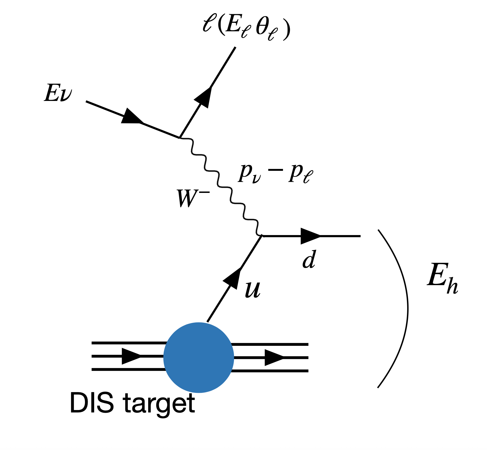
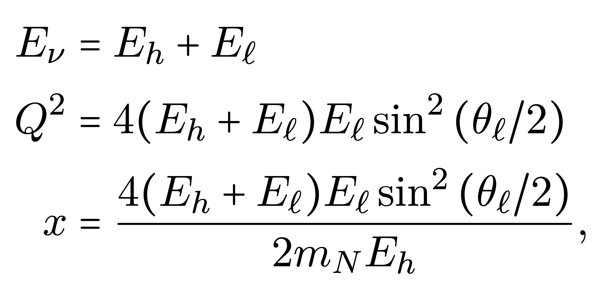
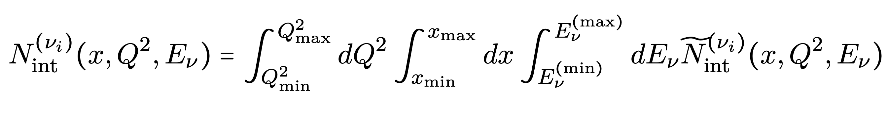
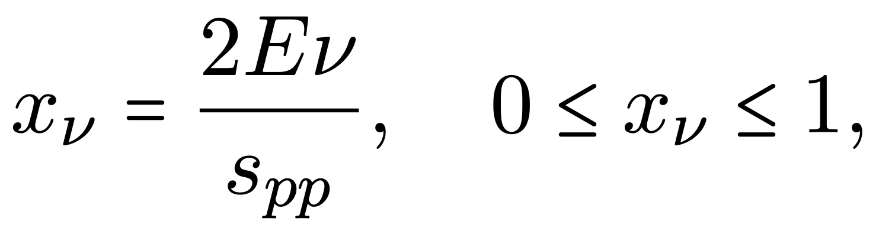
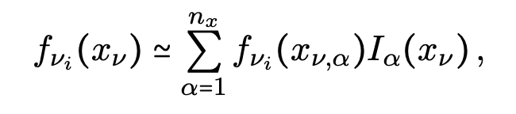
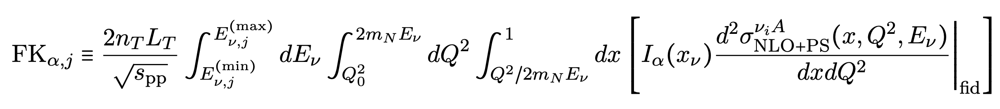
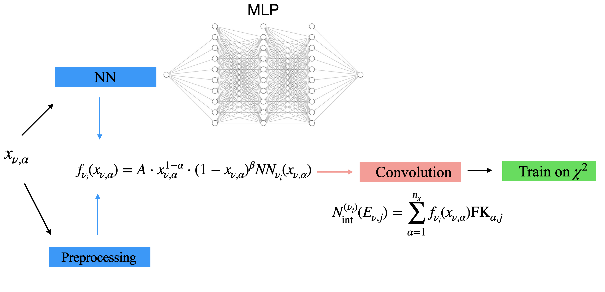
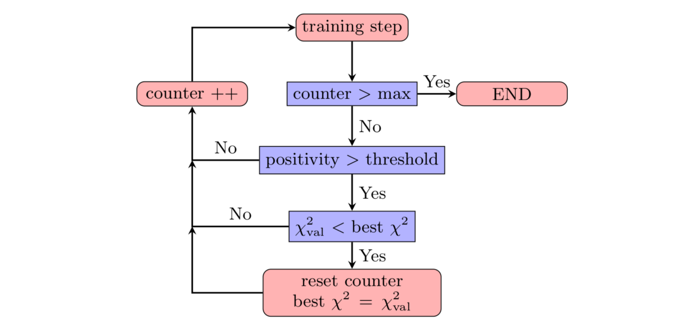

# A brief overview of the NNfluxnu framework

## Equivalence with NNPDF
First of all, the framework is based on the NNPDF framework, which uses feed-forward NNs to fit PDFs from DIS structure functions. The equivalence with NNPDF is exploited in large parts of this framework.

## DIS, neutrino fluxes and event rate measurements
The neutrinos at the LHC are decay products of forward hadron production. These hadrons are produced from pp collisions at ATLAS. The neutrinos go in the forward direction and eventually arrive ~500m downstream the FASER/SND@LHC experiments. At the FASER experiment the neutrino react via deep inelastic scattering using a Tungsten target.
First of all it is important to know how the neutrino fluxes and the event rate measurements are related to each other by DIS variables and kinematic variables.

The neutrinos react via tungsten using deep inelastic scattering like this:

Where kinematic variables and the DIS variables are related to each other by:
<!--  -->
$E_\nu = E_h + E_\ell$ 

$Q^2 = 4(E_h + E_\ell)E_\ell \sin^2\left(\frac{\theta_\ell}{2}\right)$ 

$x = \frac{4(E_h + E_\ell)E_\ell \sin^2\left(\frac{\theta_\ell}{2}\right)}{2m_N E_h},$

In terms of these variables the charged current event rates are related to the neutrino flux by three integrals expressed in this equation:
<!-- 
 -->
$N^{(\nu_i)}_{\text{int}}(x, Q^2, E_\nu) = \int_{Q^2_{\text{min}}}^{Q^2_{\text{max}}} dQ^2 \int_{x_{\text{min}}}^{x_{\text{max}}} dx \int_{E_\nu^{\text{(min)}}}^{E_\nu^{\text{(max)}}} dE_\nu \, \widetilde{N}^{(\nu_i)}_{\text{int}}(x, Q^2, E_\nu)$

where the integrand is given by
<!--  -->
$\widetilde{N}^{(\nu_i)}_{\text{int}}(x, Q^2, E_\nu) \equiv n_T L_T \times \frac{dN_{\nu_i}(E_\nu)}{dE_\nu} \times \frac{d^2\sigma^{\nu_i A}(x, Q^2, E_\nu)}{dx dQ^2} \times \mathcal{A}(E_\ell, \theta_\ell, E_h)$

where:

- $n_T$ and $L_T$ is the atomic density of the target material (Tungsten) and the length of the detector, respectively. 

- $\frac{dN_{\nu_i}(E_\nu)}{dE_\nu}$ is the neutrino flux.

- $\frac{d^2\sigma^{\nu_i A}(x, Q^2, y)}{dx dQ^2} = \frac{G_F^2}{4\pi x \left(1 + Q^2/m_W^2\right)^2} \left[ Y_+ F_2^{\nu p}(x, Q^2) - y^2 F_L^{\nu p}(x, Q^2) + Y_- x F_3^{\nu p}(x, Q^2) \right]$

- $\mathcal{A}(E_\ell, \theta_\ell, E_h)$ is an acceptance factor modelling the acceptance region of the detector.

## Fast-Kernel tables: computational efficiency
As can be seen from the equations above, the flux and the event rates are related to each other through several integrals. When trying to parametrise a neutrino flux using an NN this is very computationally expensive, since every new try for the flux results in having to do several integrals. This is why Fast-Kernel are used in this framework to replace the convolutions by a single matrix multiplication. The idea is to take the neutrino flux outside of the integral by expressing it in terms of al inear expansion using Lagrange polynomials. In order to arrive at this result, first the neutrino PDF is defined as :

$f_{\nu_i} = \frac{s_{pp}}{2} \frac{dN_{\nu_i}(E_\nu)}{dE_\nu}, \quad i = e, \nu, \tau$

Where $x_\nu$ is the momentum fraction and is defined as:
<!--  -->
$x_\nu = \frac{2 E_\nu}{s_{pp}}, \quad 0 \leq x_\nu \leq 1$

and where $s_{pp}$ is the center of mass from the proton-proton collision. 

The neutrino PDF is then expressed in a linear expansion in an interpolation basis:
<!--  -->
$f_{\nu_i}(x_\nu) \simeq \sum_{\alpha=1}^{n_x} f_{\nu_i}(x_{\nu,\alpha}) I_\alpha(x_\nu)$

Where $I_\alpha(x_\nu)$ are Lagrange polynomials

Then the number of events are related to the neutrino PDF as follows:
<!--  -->
$N^{(\nu_i)}_{\text{int}}(E_\nu) = \sum_{\alpha=1}^{n_x} f_{\nu_i}(x_{\nu,\alpha}) \int_{E_\nu^{\text{(min)}}}^{E_\nu^{\text{(max)}}} dE_\nu 
\int_{Q^2_{\alpha}=1\,\text{GeV}^2}^{2m_N E_\nu} dQ^2 
\int_{Q^2/2m_N E_\nu}^{1} dx \left[ n_T L_T \times \frac{2}{\sqrt{s_{pp}}} I_\alpha(x_\nu) \times \left. \frac{d^2\sigma^{\nu_i A}_{\text{NLO+PS}}(x, Q^2, E_\nu)}{dx dQ^2} \right|_{\text{fid}} \right]$

And the FK-table is given by
<!--  -->
$\text{FK}_{\alpha,j} \equiv \frac{2 n_T L_T}{\sqrt{s_{pp}}} \int_{E_\nu^{\text{(min)}}}^{E_\nu^{\text{(max)}}} dE_\nu 
\int_{Q_0^2}^{2m_N E_\nu} dQ^2 
\int_{Q^2 / 2m_N E_\nu}^{1} dx \left[ I_\alpha(x_\nu) \frac{d^2\sigma^{\nu_i A}_{\text{NLO+PS}}(x, Q^2, E_\nu)}{dx dQ^2} \right]_{\text{fid}}$

And the number of scattering events, the fk-table and the neutrino PDF are then related to each other as follows:
<!--  -->
$N^{(\nu_i)}_{\text{int}}(E_\nu, j) = \sum_{\alpha=1}^{n_x} f_{\nu_i}(x_{\nu,\alpha}) \text{FK}_{\alpha,j}$

A schematic picture of what happens is displayed below:

## The Machine Learning model
The structure of the machine learning model looks like:

A preprocessing function is imposed to increase computational efficiency, smooth the paramterisation and impose non-divergent behaviour at low and high x. The NN used in the framework contains a few hidden layers with a few nodes. The loss is defined as:
<!--  -->
$chi^2 = \sum_{i,j}^{N_{\text{dat}}} (D - P)_i \, C^{-1}_{ij} \, (D - P)_j,$

There is also an option to extend the loss to also make sure the neutrino PDF is positive definite when this is not imposed by the activation functions.

When training the NN, a so-called stopping algorithm is employed, which looks like:

The idea is to stop training when the loss stops decreasing with a number of patience epochs to prevent the training from stopping too early.

As is the case in NNPDF, the uncertainties on the neutrino PDFs are computed by running so-called closure tests. Using the errors on the data, N Monte Carlo replicas are produced and fitted. Then, the mean and standard deviation is computed using N neutirno PDFs from these N fits. 

The specific parameters used in this work, like the activation function and the optimizer can be found in the fit_settings.yaml file. 

## Hyperoptimization algorithm
An hyperparameter optimization algorithm is also available. The idea behind this algorithm is generality i.e. the methodology should work for all datasets, provided the hyperparameters chosen are sensible. The algorithm in this work uses k-fold cross validation and bayesian optimization to find the best set of hyperparameters. The idea behind k-fold cross validation is to fit the entire dataset consisting of k-folds, except for one. This is then iterated until all possible partitions have been fitted. The hyperparameters which produced the lowest mean loss is then used to run the fit. Bayesian optimization is employed to find this minimum.
## Postfit analysis
The postfit analysis consists of two parts: postift criteria and postfit measures. The first one checks if there is a certain fitted neutrino PDF which did not converge. For example, if the $\chi^2$ from a particular replica deviates more than 4$\sigma$ from the mean $\chi^2$ computed using all the replicas, this replica is discarded. The postfit measures are used to assess the quality of the fit using several statistical measures, such as computing the degree to which the fit has been an overfit/underfit. 

